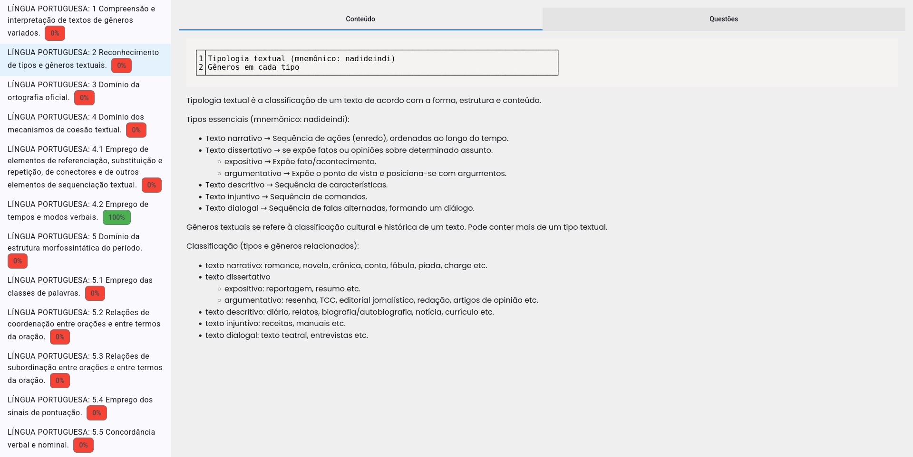
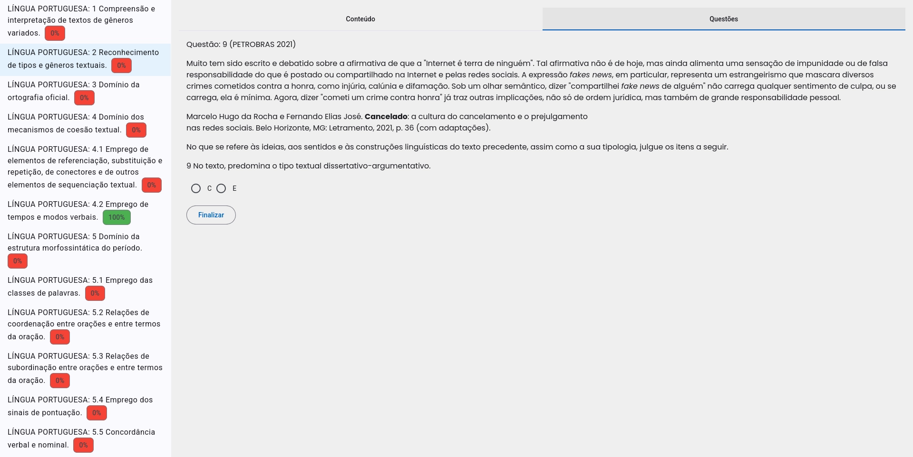

# preparacao-exames

Aplicação para administrar seus estudos de forma simples, combinando conteúdo e
questões, com **score** indicando grau de assimiliação de assunto.





Execute a aplicação:

```bash
$ npm install
$ ng serve
```

TODO:
- [ ] Página *admin* para gerenciar conteúdos e questões
